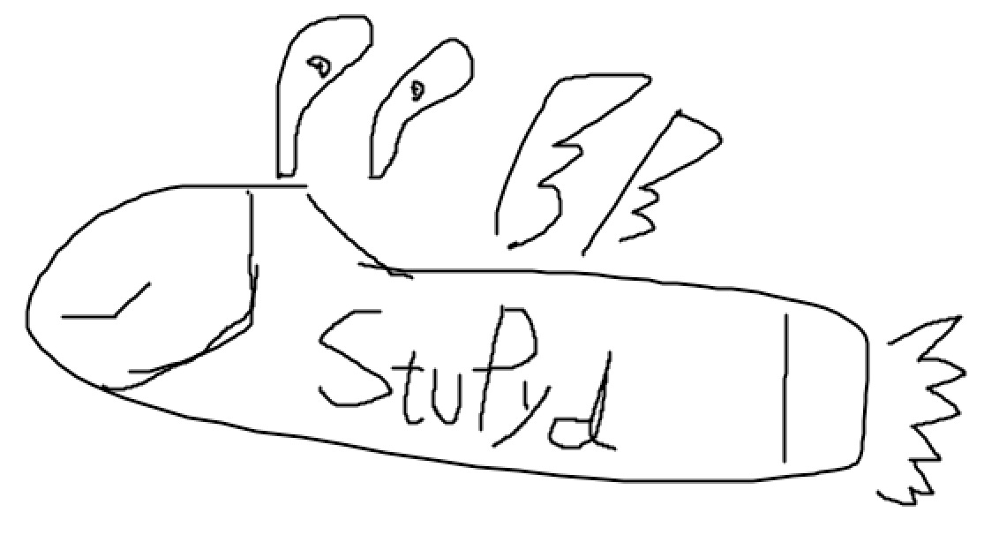

 
# StuPyd 

StuPyd is an interpreted high-level programming language for programming education. It is intended to have a easy-to-read syntax and useful intergrated data structures with related operation methods to help its users to understand programming and other related computer science concepts.

[Github Repository](https://github.com/MuchenSun/stupyd-lang)

[PyPI Project](https://pypi.org/project/stupyd)

## Table of Content

* [Getting Started](getting-started/getting-started.html)
	* [What's StuPyd ?]()
	 	
	* [Setup and Usage](getting-started/setup-and-usage.html)
	
	* [A Tour of StuPyd]()

* [Tutorial]()

* [Language Reference]()

* [Behind StuPyd](behind-stupyd/behind-stupyd.html)
	* [Execution of StuPyd code]()
	
	* [Lexer and Parser]()
	
	* [Interpreter]()

* [About Us]()
